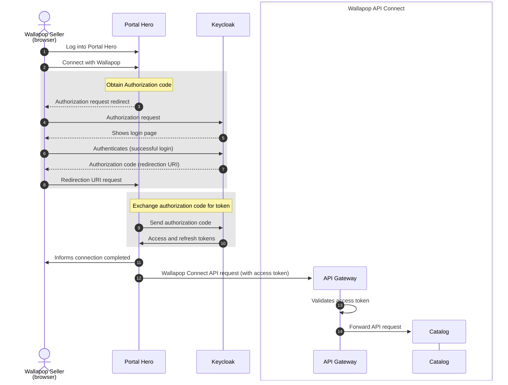

# IAM
Identity and access manager (Keycloak)

## Steps 

1- Build users [extension](./extensions/docs)

2 -Run docker compose

4- Download [oauth2c](https://github.com/cloudentity/oauth2c) and run :
```
oauth2c "http://localhost:9090/realms/wallapop-connect" \
--browser-timeout 30s  \
--grant-type authorization_code  \
--pkce  \
--client-id portal-hero  \
--client-secret dSGJlZFLlIZN2ZCIXeW0lAWuq5bnzxHI  \
--auth-method client_secret_basic  \
--response-types code  \
--response-mode query 
```


# Flows

## Authorization flow

Notes:

- The authorization flow that we are using is _authorization code grant_ with PKCE
- PKCE is optional, but we are using it for additional security purposes (as recommended in [the OAuth RFC](https://datatracker.ietf.org/doc/html/draft-ietf-oauth-security-topics-26#name-authorization-code-grant))
- [Standard _authorization code grant_ flow as explained in RFC](https://datatracker.ietf.org/doc/html/rfc6749#section-4.1)



Flow details:

1. The seller logs into Portal Hero with their Portal Hero user and password
2. The seller initiates the action for allowing PortalHero interact with Wallapop on their behalf
3. Portal Hero redirects the seller to Keycloak authorization endpoint
   ```
   GET http://localhost:9090/realms/wallapop-connect/protocol/openid-connect/auth
   Query params:
   nonce: 3sDzwHqEV5kvxvLkbR9d2x
   redirect_uri: http://localhost:9876/callback
   response_mode: query
   response_type: code
   state: haeMd6UffZpxLDRWkNbAMW
   client_id: portal-hero
   code_challenge: k7Xkh4lovg1rqcUov1_Y0TgYHUfwwW5kASjyq0wR4k8
   code_challenge_method: S256
   
   ┌─ PKCE ──────────────────────────────────────────────────────────┐
   | code_verifier = 4PGG17Pf4MRaLT5U4GXhJjUJ7pAHp0T47zbtIZHYq3S     |
   | code_challenge = BASE64URL-ENCODE(SHA256(ASCII(code_verifier))) |
   └─────────────────────────────────────────────────────────────────┘
   ```
   - `nonce` - TODO
   - `redirect_uri` - the URI configured for the client in Keycloak 
   - `response_mode` - TODO
   - `response_type` - TODO
   - `state` - TODO
   - `client_id` - the ID of the client configured in Keycloak
   - `code_challenge` - the computed code challenge
   - `code_challenge_method` - the hashing method of the code challenge
4. The seller's browser redirects to Keycloak authorization endpoint
5. Keycloak shows the seller the login page to authenticate them
6. The seller successfully authenticates as a Wallapop user through Keycloak
7. Keycloak redirects the seller to Portal Hero with the authorization code
   ```
   GET /redirection-uri
   Query params:
   state: haeMd6UffZpxLDRWkNbAMW
   session_state: 9c296d6e-1353-43ab-91ec-d8df10532938
   iss: http://localhost:9090/realms/wallapop-connect
   code: 0d40629c-89f8-4eca-ba36-35ef81682e67.9c296d6e-1353-43ab-91ec-d8df10532938.ffd2a2ce-d2b7-4ebd-ac3a-a3f2a6a96a46
   ```
   - `state` - TODO
   - `session_state` - TODO
   - `iss` - issuer of the authorization code (in this case, Keycloak)
   - `code` - the authorization code
8. The seller's browser redirects to Portal Hero
9. Portal Hero exchange the authorization code for the access and refresh tokens (including PKCE code verifier)
10. Keycloak returns both access and refresh tokens to Portal Hero
11. Portal Hero informs the seller about the connection to Wallapop
12. Portal Hero calls Wallapop Connect API using the access token
13. API Gateway validates the access token
14. On successful validation, API Gateway forwards the request to Catalog

# Deployment

1. Merge PR into `main`
2. Trigger deploy with Deploy bot: `deploy env=prod service=iam tag=main`
