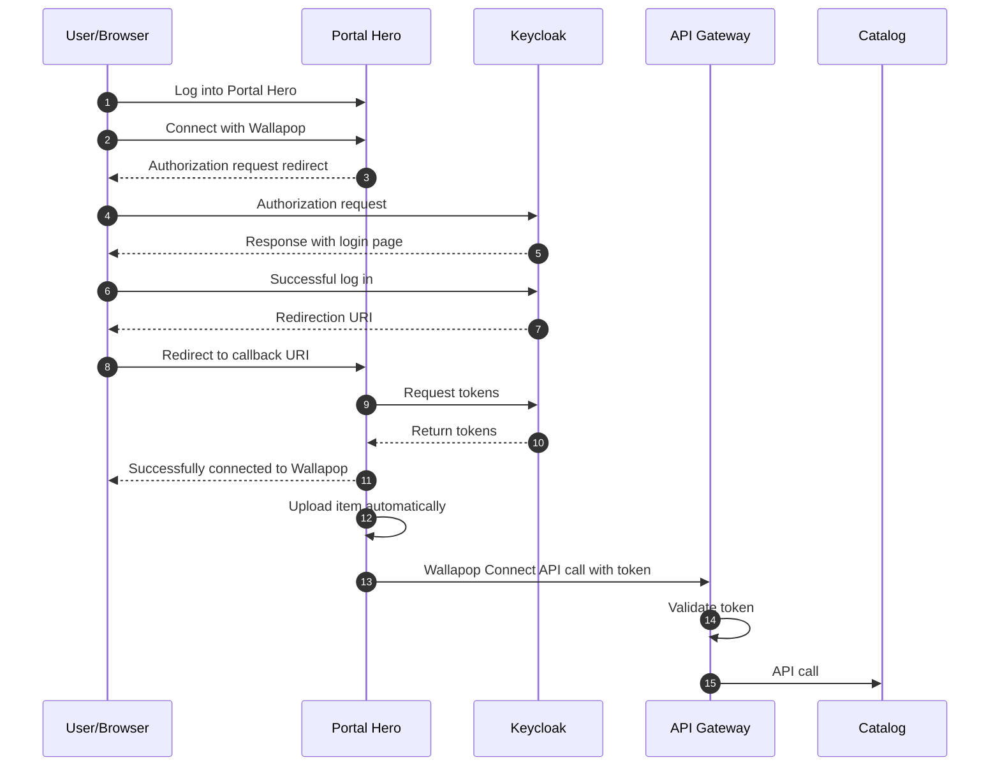

# IAM
Identity and access manager (Keycloak)

1- Run docker compose 

2- Select `wallapop-connect` realm

3- Create a user with password (complete all data and put "email verified" in false)

4- Download [oauth2c](https://github.com/cloudentity/oauth2c) and run :
```
oauth2c "http://localhost:9090/realms/wallapop-connect" \
--browser-timeout 30s  \
--grant-type authorization_code  \
--pkce  \
--client-id portal-hero  \
--client-secret OiICRTehnwyXkKOVRAFFbTKNjAp2ez4w  \
--auth-method client_secret_basic  \
--response-types code  \
--response-mode query 
```


# Flows

## Authorization flow

Notes:

- The authorization flow that we are using is _authorization code grant_ with PKCE
- PKCE is optional, but we are using it for additional security purposes (as recommended in [the OAuth RFC](https://datatracker.ietf.org/doc/html/draft-ietf-oauth-security-topics-26#name-authorization-code-grant))
- [Standard _authorization code grant_ flow as explained in RFC](https://datatracker.ietf.org/doc/html/rfc6749#section-4.1)



Flow details:

1. The user logs into Portal Hero with their usual credentials
2. The user performs the action of connecting their PortalHero account with Wallapop
3. Portal Hero responds with a redirect to Keycloak for the authorization request in the next step
   ```
   GET http://localhost:9090/realms/wallapop-connect/protocol/openid-connect/auth
   Query params:
   nonce: 3sDzwHqEV5kvxvLkbR9d2x
   redirect_uri: http://localhost:9876/callback
   response_mode: query
   response_type: code
   state: haeMd6UffZpxLDRWkNbAMW
   client_id: portal-hero
   code_challenge: k7Xkh4lovg1rqcUov1_Y0TgYHUfwwW5kASjyq0wR4k8
   code_challenge_method: S256
   
   ┌─ PKCE ──────────────────────────────────────────────────────────┐
   | code_verifier = 4PGG17Pf4MRaLT5U4GXhJjUJ7pAHp0T47zbtIZHYq3S     |
   | code_challenge = BASE64URL-ENCODE(SHA256(ASCII(code_verifier))) |
   └─────────────────────────────────────────────────────────────────┘
   ```
   - `nonce` - TODO
   - `redirect_uri` - the URI configured for the client in Keycloak 
   - `response_mode` - TODO
   - `response_type` - TODO
   - `state` - TODO
   - `client_id` - the ID of the client configured in Keycloak
   - `code_challenge` - the computed code challenge
   - `code_challenge_method` - the hashing method of the code challenge
4. The browser executes the redirection to Keycloak - note that PKCE parameters are sent as well
5. Keycloak responds with the login page to authenticate the user
6. The is successfully authenticated in Keycloak
7. Keycloak responds with the redirection to Portal Hero
   ```
   GET /callback
   Query params:
   state: haeMd6UffZpxLDRWkNbAMW
   session_state: 9c296d6e-1353-43ab-91ec-d8df10532938
   iss: http://localhost:9090/realms/wallapop-connect
   code: 0d40629c-89f8-4eca-ba36-35ef81682e67.9c296d6e-1353-43ab-91ec-d8df10532938.ffd2a2ce-d2b7-4ebd-ac3a-a3f2a6a96a46
   ```
   - `state` - TODO
   - `session_state` - TODO
   - `iss` - issuer of the authorization code (in this case, Keycloak)
   - `code` - the authorization code
8. The browser executes the redirection to Portal Hero (with code verifier as per PKCE)
9. Portal Hero perform the token request to Keycloak
10. Keycloak returns both access and refresh tokens
11. Portal Hero informs the user that their account has been successfully connected to Wallapop
12. Some time later (undefined how much later) Portal Hero automatically tiggers the action importing items to the user's Wallapop account
13. Portal Hero calls Wallapop Connect API with the access token
14. API Gateway ensures the token is valid
15. On successful validation, API Gateway forwards the request to Catalog