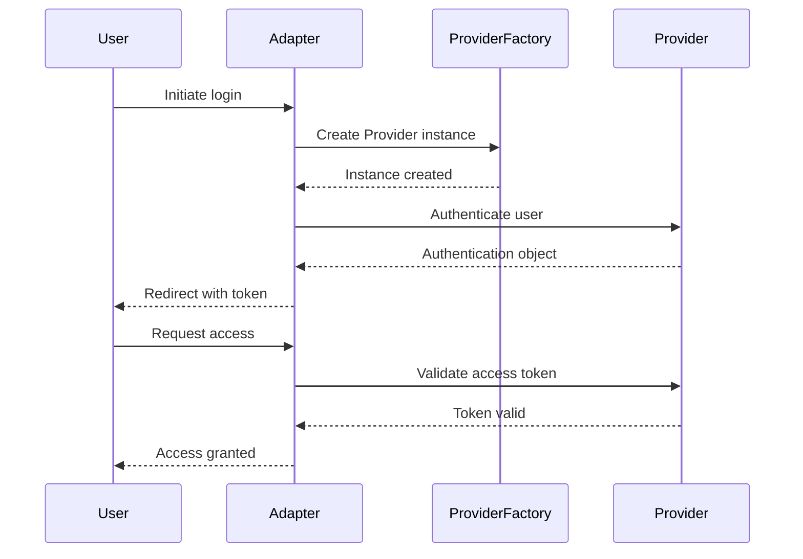

Extensions
========================================================

This folder contains the used extensions in this project. They are based on 
[Keycloak official examples](https://github.com/keycloak/keycloak-quickstarts)

All you need to build this project is Java 17 (Java SDK 17) or later and Maven 3.6.3 or later.


Monolith Users JPA connection 
========================================================

This is a module that will be added in Keycloak user federation.
It will use an external database to authenticate users.

### Build

Under `monolith-users` module in run:
   ````
   mvn -Pextension clean install -DskipTests=true
   ````

#### For testing purposes:
* The database connection will be read by the `docker-compose` from `monolith-users/conf/quarkus.properties` and put
in `/opt/keycloak/conf`. Place where  Keycloak needs it.
* The `.jar` will be added into `/opt/keycloak/providers/` place where Keycloak put the user federated providers by the 
`docker-compose`. 
* The `realm.json` already has the configuration to use it.




